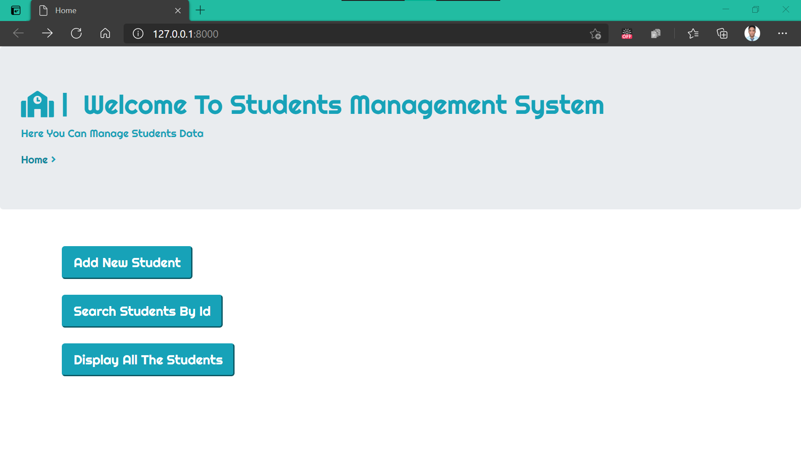
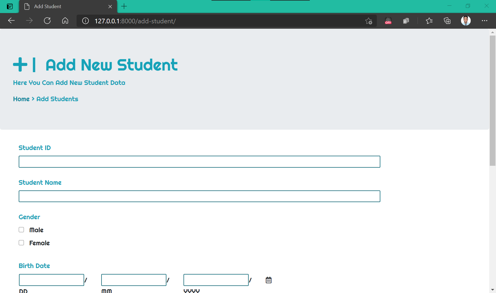
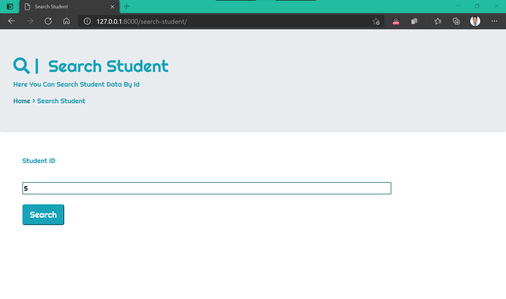
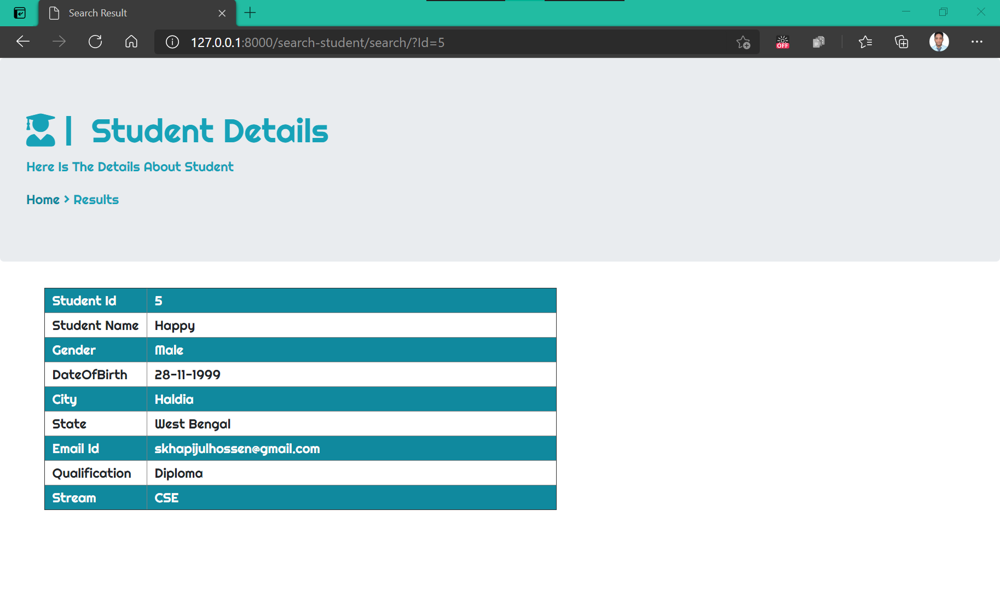
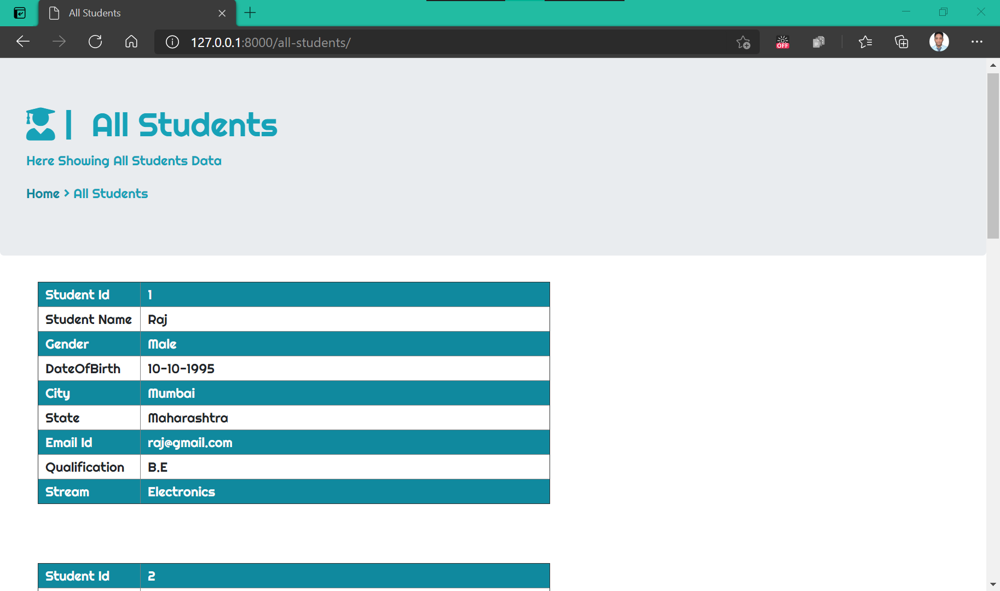

# django-StudentManagementSystem
This Web Application Will help to Manage Students Information.

## Tools :

* HTML 
* CSS
* BootStrap4
* Python
* Django Framework
* SQL
* pandas

**Home**

**Add New Student**

**Search Student**

**Search Result**

**All Students**

